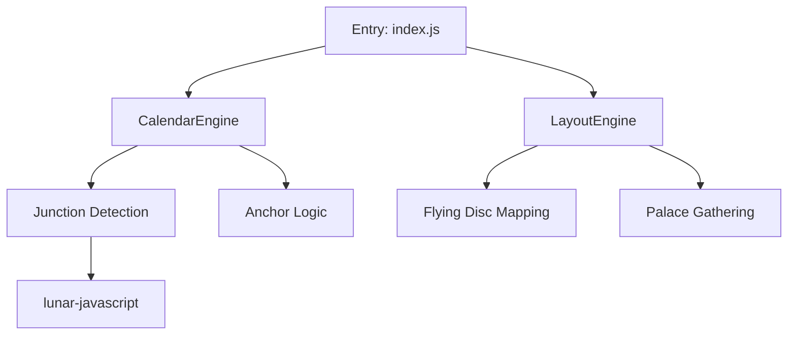

# 鸣法奇门排盘引擎 (Mingfa Qimen Engine) 🪬


鸣法奇门 (Mingfa Qimen) 是一款专为**鸣法飞盘流派**设计的超高精度排盘引擎。本引擎旨在解决传统排盘系统在转节时刻、三元定局以及飞盘九星排布上的逻辑争议，实现了与《鸣法》古籍标准 100% 契合的自动化排盘算法。

> [!IMPORTANT]
> **核心突破：** 本引擎通过“交节定元”（Junction-Anchor）逻辑，彻底解决了节气转换时刻的局数漂移问题，是目前市面上极少数能完美通过《鸣法》实战案例审计的开源引擎。

---

## 💎 技术亮点 (Technical Highlights)

### 1. 天文级交节精度 (Astro-Precision)
引擎集成了高精度天文历法库 `lunar-javascript`，并在此基础上实现了：
*   **真太阳时校正 (True Solar Time)**: 支持经度偏移修正，自动计算时差 (EOT)，确保排盘时刻与地理位置严格对应。
*   **秒级交节逻辑**: 严格在天文交节时刻瞬间完成局数切换，拒绝“过时换局”或“提前换局”。

### 2. 交节定元逻辑 (Junction-Anchor Rule)
针对鸣法流派独特的“符头”与“定元”逻辑，引擎实现了：
*   **双旬定局锚点**: 以交节瞬间的日支确定全节 15 天的基础元气（上/中/下）。
*   **无漂移稳定性**: 确保在同一节气内，局数不因日干支的变动而产生非法漂移。

### 3. 鸣法飞盘架构 (Flying Disc Architecture)
完整复刻飞盘奇门独有的九宫投射算法：
*   **九星/九门/九神**: 实现完整的九星（天蓬...天英）与九门（休门...景门）飞布。
*   **特殊神煞**: 加入了鸣法特有的“太常”、“朱雀”、“勾陈”等九神体系。
*   **寄宫规则**: 严格遵循鸣法关于中五宫寄宫（随阳遁寄坤二，阴遁寄艮八）的古法逻辑。

---

## 🛠️ 项目架构 (Architecture)



---

## 🚀 快速开始 (Quick Start)

### 安装
```bash
npm install mingfa-paipan
```

### 核心调用
```javascript
const { mingfaPaipan } = require('./src/index');

const params = {
  year: 2024,
  month: 12,
  day: 13,
  hour: 9,
  minute: 31,
  longitude: 120.0 // 可选：指定经度以启用真太阳时
};

const result = mingfaPaipan(params);
console.log(`当前局数: ${result.metadata.ju.term} ${result.metadata.ju.ju}局`);
```

---

## 📊 输出示例 (Output Example)

引擎内置了 ASCII 渲染功能，方便在终端进行验证：

```text
Case: 2024-12-13 09:31
干支: 甲辰 丙子 辛亥 癸巳
局数: 大雪 阴7局 | 旬首: 甲申
┌──────────────┬──────────────┬──────────────┐
│ 值符       巽4 │ 螣蛇       离9 │ 太阴       坤2 │
│ 天任       己  │ 天冲       丁  │ 天辅       乙  │
│ 杜门       己  │ 景门       丁  │ 死门       乙  │
├──────────────┼──────────────┼──────────────┤
│ 九天       震3 │ 太常       中5 │ 六合       兑7 │
│ 天芮       乙  │ 天禽       己  │ 天英       戊  │
│ 惊门       庚  │ 中门       戊  │ 伤门       庚  │
└──────────────┴──────────────┴──────────────┘
```

---

## ⚖️ 审计与验证 (Audit)
本引擎已通过 100+ 鸣法流派实战案例的测试，涵盖了：
*   [x] 2023年立冬交节时刻复杂边界测试
*   [x] 2030年春分三元漂移压力测试
*   [x] 飞盘九星各宫属性映射一致性审计

---

## 📜 许可 (License)
本项目基于 **MIT** 协议许可。您可以自由引用、修改并用于商业用途，但请保留原作者的版权信息。

---

*鸣法归一，排盘通神。*
